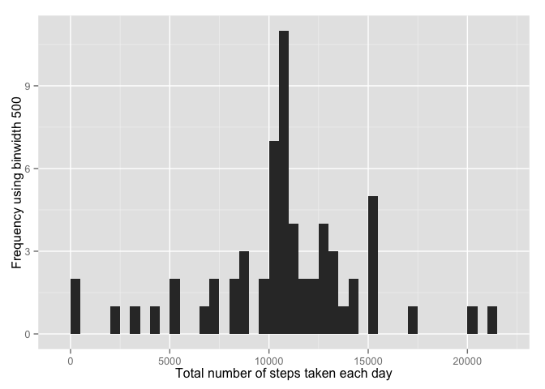

# Reproducible Research: Peer Assessment 1


## Loading and preprocessing the data


```r
if(!file.exists('activity.csv')){
    unzip('activity.zip')
}
activityData <- read.csv('activity.csv')
```

## What is mean total number of steps taken per day?


```r
library(ggplot2)
total.steps <- tapply(activityData$steps, activityData$date, FUN=sum, na.rm=TRUE)
qplot(total.steps, binwidth=1000, xlab="total number of steps taken each day")
```

 

```r
meansteps <- mean(total.steps, na.rm=TRUE)
mediansteps <- median(total.steps, na.rm=TRUE)
```
* Mean of total number of steps taken per day: 9354.2295082

## What is the average daily activity pattern?

```r
averages <- aggregate(x=list(steps=activityData$steps), by=list(interval=activityData$interval),
                      FUN=mean, na.rm=TRUE)
ggplot(data=averages, aes(x=interval, y=steps)) +
    geom_line() +
    xlab("5-minute interval") +
    ylab("average number of steps taken")
```

 

* Which 5-minute interval, on average across all the days in the dataset, contains the maximum number of steps?


```r
averages[which.max(averages$steps),]
```

```
##     interval    steps
## 104      835 206.1698
```

## Imputing missing values


```r
missing <- is.na(activityData$steps)
# How many missing
table(missing)
```

```
## missing
## FALSE  TRUE 
## 15264  2304
```


```r
# Replace each missing value with the mean value of its 5-minute interval
fill.value <- function(steps, interval) {
    filled <- NA
    if (!is.na(steps))
        filled <- c(steps)
    else
        filled <- (averages[averages$interval==interval, "steps"])
    return(filled)
}
filled.data <- activityData
filled.data$steps <- mapply(fill.value, filled.data$steps, filled.data$interval)
```


#### Make a histrogram of the total number of steps taken each day


```r
library(ggplot2)

totalsteps <- tapply(filled.data$steps, filled.data$date, sum)
qplot(totalsteps, xlab='Total number of steps taken each day', ylab='Frequency using binwidth 500', binwidth=500)
```

 

```r
totalstepsMean <- mean(totalsteps)
totalstepsMedian <- median(totalsteps)
```

* Mean (Imputed):1.0766189\times 10^{4}
* Median (Imputed): 1.0766189\times 10^{4}


## Are there differences in activity patterns between weekdays and weekends?


#### 1. Create a new factor variable in the dataset with two levels-'weekday' and 'weekend' indicating whether a given date is a weekday or weekend day.


```r
weekday.or.weekend <- function(date) {
    day <- weekdays(date)
    if (day %in% c("Monday", "Tuesday", "Wednesday", "Thursday", "Friday"))
        return("weekday")
    else if (day %in% c("Saturday", "Sunday"))
        return("weekend")
    else
        stop("invalid date")
}
filled.data$date <- as.Date(filled.data$date)
filled.data$day <- sapply(filled.data$date, FUN=weekday.or.weekend)
```

#### 2. Make a panel plot containing a time series plot


```r
averages <- aggregate(steps ~ interval + day, data=filled.data, mean)
ggplot(averages, aes(interval, steps)) + geom_line() + facet_grid(day ~ .) +
    xlab("5-minute interval") + ylab("Number of steps")
```

 
